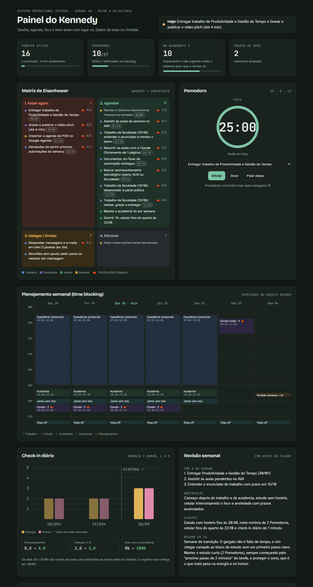
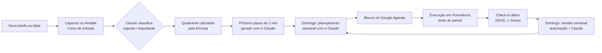
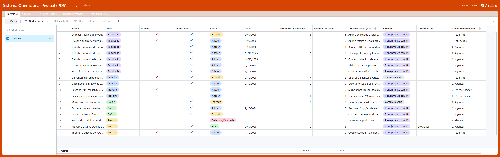
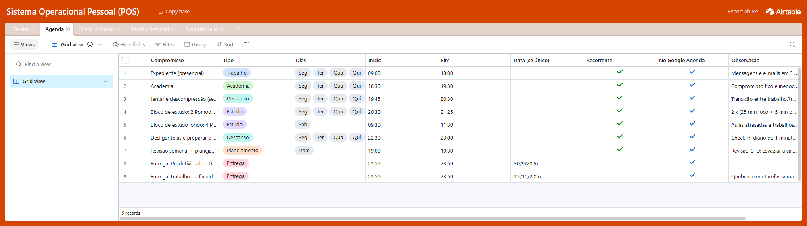
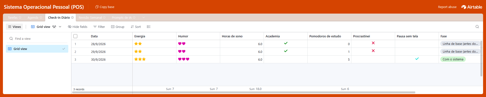
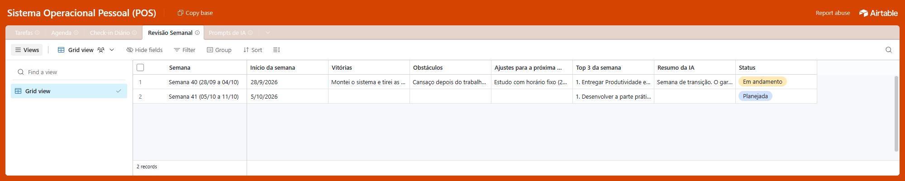

# Sistema Operacional Pessoal (POS)

Sistema de produtividade pessoal que junta **Airtable**, **Google Agenda** e **IA (Claude)** para organizar tarefas, planejar a semana, gerir compromissos, acompanhar foco e bem-estar e melhorar a comunicação profissional. Aplica **GTD**, **Matriz de Eisenhower**, **Pomodoro** e **time blocking**.

> Trabalho da disciplina **Produtividade e Gestão do Tempo**, UniFECAF, 2º semestre. Aluno: **Kennedy Pereira**.

---

## Índice

1. [Visão geral](#1-visão-geral)
2. [Links do projeto](#2-links-do-projeto)
3. [O problema e a solução](#3-o-problema-e-a-solução)
4. [Ferramentas utilizadas](#4-ferramentas-utilizadas)
5. [Métodos de produtividade](#5-métodos-de-produtividade)
6. [Estrutura no Airtable](#6-estrutura-no-airtable)
7. [Fluxo de organização](#7-fluxo-de-organização)
8. [Uso de IA](#8-uso-de-ia)
9. [Dashboard de acompanhamento](#9-dashboard-de-acompanhamento)
10. [Como utilizar a solução](#10-como-utilizar-a-solução)
11. [Prints](#11-prints)
12. [Resultados e próximos passos](#12-resultados-e-próximos-passos)
13. [Entregáveis](#13-entregáveis)
14. [Organização dos arquivos](#14-organização-dos-arquivos)

---

## 1. Visão geral

| | |
|---|---|
| **Ferramenta principal** | Airtable, base *Sistema Operacional Pessoal (POS)* com 5 tabelas |
| **Agenda** | Google Agenda, blocos importados por arquivo `.ics` com lembretes |
| **IA** | Claude: planejamento semanal, Matriz de Eisenhower, quebra de tarefas, mensagens e revisão semanal |
| **Automação** | Airtable: todo domingo às 19h cria o registro da Revisão Semanal |
| **Técnicas** | GTD, Matriz de Eisenhower (fórmula automática), Pomodoro, time blocking e regra dos 2 minutos |
| **Painel** | Dashboard web com indicadores, matriz, timer Pomodoro, agenda semanal, check-in de bem-estar e prompts |



---

## 2. Links do projeto

- **Vídeo Pitch:** _[colar o link do YouTube/Loom/Drive]_
- **Dashboard (Painel POS):** https://claude.ai/artifact/JZHFT2irWLy7iPYgsBy9dC
- **Base no Airtable (somente leitura):** _[colar o link de compartilhamento da base]_
- **Parte teórica:** [docs/parte-teorica.md](docs/parte-teorica.md)

---

## 3. O problema e a solução

**Antes.** Trabalho presencial das 09h às 18h, academia depois, e o estudo da faculdade ficava com a sobra da noite, sem horário e no momento de menor energia. Nenhuma ferramenta de organização: tudo na memória. Resultado: **procrastinação**, **cansaço**, prazos lembrados tarde e ansiedade com o acúmulo.

**Depois.** Um sistema único onde:

1. toda tarefa é **capturada** no Airtable (GTD) e classificada automaticamente na **Matriz de Eisenhower**;
2. cada tarefa tem um **próximo passo de 2 minutos**, gerado com ajuda da IA, para facilitar o começo;
3. a semana é planejada em **blocos de tempo** que aparecem no Google Agenda com lembrete;
4. o estudo acontece em **Pomodoros**, com meta mínima de 2 por noite;
5. um **check-in diário** de 1 minuto registra energia, humor, sono e hábitos;
6. no domingo, a **revisão semanal com o Claude** analisa os dados e ajusta o plano.

---

## 4. Ferramentas utilizadas

| Ferramenta | Uso | Por que |
|---|---|---|
| **Airtable** | Núcleo: tarefas, agenda, check-ins, revisões e prompts | Banco de dados visual com fórmulas, visualizações e automações. Mede hábitos ao longo do tempo, o que o Trello não faz bem |
| **Google Agenda** | Lembretes dos blocos no celular | Já faz parte do meu dia; importação única via `.ics` |
| **Claude** | IA de apoio ao planejamento e à comunicação | Entende contexto longo e responde em tabelas prontas para o Airtable |
| **Painel POS** | Visão da semana numa tela | Junta indicadores, matriz, Pomodoro e bem-estar |
| **Python** | Script `agenda/gerar_ics.py` | Gera a agenda recorrente sem cadastrar evento por evento |

---

## 5. Métodos de produtividade

| Método | Desafio que ataca | Onde está no sistema |
|---|---|---|
| **GTD** | Tudo na memória | Status *Caixa de entrada* e tabela *Revisão Semanal* |
| **Matriz de Eisenhower** | Decidir prioridades | Campos *Urgente* e *Importante* + fórmula *Quadrante* |
| **Pomodoro** | Cansaço e procrastinação | Estimativas em 🍅, check-in e timer no painel |
| **Time blocking** | Estudo sem horário | Tabela *Agenda* + Google Agenda |
| **Regra dos 2 minutos** | Dificuldade de começar | Campo *Próximo passo (2 min)* |

Fórmula do quadrante no Airtable:

```
IF(AND({Urgente},{Importante}),"1. Fazer agora",
  IF({Importante},"2. Agendar",
    IF({Urgente},"3. Delegar/limitar","4. Eliminar")))
```

---

## 6. Estrutura no Airtable

| Tabela | Campos principais | Função |
|---|---|---|
| **Tarefas** | Tarefa, Área, Urgente, Importante, Quadrante (fórmula), Status, Prazo, Pomodoros estimados/feitos, Próximo passo (2 min), Origem | Organização de tarefas e prioridades |
| **Agenda** | Compromisso, Tipo, Dias, Início, Fim, Data, Recorrente, No Google Agenda | Gestão de compromissos e blocos de tempo |
| **Check-in Diário** | Data, Energia (1-5), Humor (1-5), Horas de sono, Academia, Pomodoros de estudo, Procrastinei, Pausa sem tela, Fase | Acompanhamento de produtividade e bem-estar |
| **Revisão Semanal** | Semana, Vitórias, Obstáculos, Ajustes, Top 3, Resumo da IA, Status | Planejamento semanal e revisão GTD |
| **Prompts de IA** | Prompt, Quando usar, Objetivo, Texto do prompt | Biblioteca de IA reutilizável |

**Automação:** *Domingo 19h: criar Revisão Semanal* (gatilho agendado → criar registro com status *Planejada*).

---

## 7. Fluxo de organização



| Momento | Ritual | Tempo |
|---|---|---|
| A qualquer hora | Capturar tarefa na caixa de entrada | 30 s |
| Manhã (trabalho) | Ver o painel: prazos de hoje e quadrante 1 | 2 min |
| 09h15 · 13h30 · 17h15 | Janelas de mensagens e e-mails | 15 min |
| 20h30 (seg-qui) | 2 Pomodoros de estudo, começando pelo próximo passo | 55 min |
| 22h30 | Check-in diário e telas desligadas | 1 min |
| Domingo 19h | Revisão + planejamento semanal com o Claude | 30 min |

---

## 8. Uso de IA

O Claude é usado em cinco pontos. Os prompts completos estão em [prompts/prompts.md](prompts/prompts.md), na tabela *Prompts de IA* do Airtable e no painel (botão *Copiar prompt*).

| Uso | O que a IA faz | Resultado no sistema |
|---|---|---|
| **Planejar** | Classifica tarefas, distribui nos blocos sem passar da capacidade e escolhe o Top 3 | Tabela *Revisão Semanal* e prazos das tarefas |
| **Priorizar** | Classifica tarefa nova em urgente/importante | Campos *Urgente* e *Importante* |
| **Destravar** | Quebra a tarefa em passos de 1 Pomodoro; o primeiro cabe em 2 minutos | Campo *Próximo passo (2 min)* |
| **Comunicar** | Reescreve mensagens com contexto, pedido, prazo e próximo passo | Mensagens mais claras, menos idas e vindas |
| **Revisar e resumir** | Lê os check-ins, aponta padrões e sugere ajustes; faz fichamento de aulas | Campo *Resumo da IA* |

**Uso consciente:** a IA sugere e eu decido. Não envio dados confidenciais do trabalho nem dados de terceiros.

---

## 9. Dashboard de acompanhamento

O **Painel POS** ([link](https://claude.ai/artifact/JZHFT2irWLy7iPYgsBy9dC) · código em [dashboard/index.html](dashboard/index.html)) mostra:

- **Linha de status** com as entregas de hoje;
- **Indicadores:** tarefas ativas, Pomodoros feitos/estimados, tarefas no quadrante 2 e prazos de hoje;
- **Matriz de Eisenhower** com área, prazo e Pomodoros de cada tarefa;
- **Timer Pomodoro** (25/5/15) ligado às tarefas, contando os ciclos do dia;
- **Planejamento semanal** em blocos de tempo (o mesmo do Google Agenda);
- **Check-in diário:** gráfico de energia e humor e comparação *linha de base → com o sistema*;
- **Revisão semanal** e **biblioteca de prompts** com botão de copiar.

Tema claro e escuro automático. Os dados vêm da base do Airtable (exportação de 30/09/2026).

---

## 10. Como utilizar a solução

### 10.1 Montar o sistema

1. **Airtable:** abra o link da base e clique em *Copy base* para ter uma cópia (ou recrie as 5 tabelas da seção 6).
2. **Automação:** em *Automations*, ative *Domingo 19h: criar Revisão Semanal*.
3. **Google Agenda:** gere a agenda e importe:
   ```bash
   python agenda/gerar_ics.py
   ```
   Depois, no Google Agenda: *Configurações › Importar e exportar › Importar* e escolha `agenda/agenda-pos.ics`. Para mudar horários, edite a lista `BLOCOS` no script.
4. **Prompts:** salve [prompts/prompts.md](prompts/prompts.md) nos favoritos ou use o botão *Copiar prompt* do painel.

### 10.2 Usar no dia a dia

1. **Capturou algo?** Crie a tarefa no Airtable com status *Caixa de entrada*.
2. **Não sabe a prioridade?** Use o prompt *Classificar tarefa* e marque *Urgente*/*Importante*.
3. **Travou?** Use o prompt *Destravar* e cole o primeiro passo em *Próximo passo (2 min)*.
4. **Hora do estudo?** Abra o painel, escolha a tarefa no Pomodoro e clique em *Iniciar*. Ao terminar, some os 🍅 em *Pomodoros feitos*.
5. **22h30:** faça o check-in (energia, humor, sono, academia, Pomodoros, procrastinação).
6. **Domingo 19h:** a automação cria a revisão; use os prompts *Revisão semanal* e *Planejamento semanal* e registre o resultado.

---

## 11. Prints

As imagens ficam em [evidencias/](evidencias/).

| # | Print | Arquivo |
|---|---|---|
| 1 | Painel POS (dashboard) |  |
| 2 | Airtable: tabela Tarefas com o quadrante calculado |  |
| 3 | Airtable: tabela Agenda (blocos de tempo) |  |
| 4 | Airtable: Check-in Diário |  |
| 5 | Airtable: Revisão Semanal com resumo da IA |  |
| 6 | Airtable: automação de domingo |  |
| 7 | Google Agenda com os blocos importados |  |
| 8 | Claude: exemplo de prompt de planejamento/destravar |  |

---

## 12. Resultados e próximos passos

O sistema entrou em uso em **30/09/2026**. Os dias 28 e 29/09 são uma **linha de base estimada** da rotina anterior.

| Indicador | Antes (estimado) | Dia 1 com o sistema |
|---|---|---|
| Pomodoros de estudo/dia | 0 a 1 | 5 |
| Procrastinação | Todos os dias | Não procrastinei |
| Energia (1-5) | 2 | 3 |
| Tarefas mapeadas | Na memória | 17 no Airtable, com prioridade |

**Ganhos percebidos:** clareza (tudo num lugar só), medição do estudo pela primeira vez, mais facilidade para começar e saúde e descanso entrando na agenda.

**Metas das próximas semanas:** 12 Pomodoros de estudo por semana, 5 dias sem procrastinação, 7h de sono e academia mantida 5x por semana.

---

## 13. Entregáveis

| Entregável | Pontos | Onde |
|---|---|---|
| Parte Teórica: Análise e Discussão | 1,5 | [docs/parte-teorica.md](docs/parte-teorica.md) (+ `.docx`/`.pdf` na pasta de entregáveis) |
| Parte Prática: Sistema Operacional Pessoal | 3,5 | Base no Airtable, painel, agenda `.ics`, prompts e este README |
| Vídeo Pitch (até 4 min) | 2,0 | Link na seção 2 |

---

## 14. Organização dos arquivos

```
sistema-operacional-pessoal/
├── README.md               ← este arquivo
├── agenda/
│   ├── gerar_ics.py        ← gera a agenda recorrente
│   └── agenda-pos.ics      ← arquivo para importar no Google Agenda
├── dashboard/
│   └── index.html          ← Painel POS
├── docs/
│   └── parte-teorica.md    ← Parte Teórica
├── evidencias/             ← prints do sistema
└── prompts/
    └── prompts.md          ← biblioteca de prompts do Claude
```
